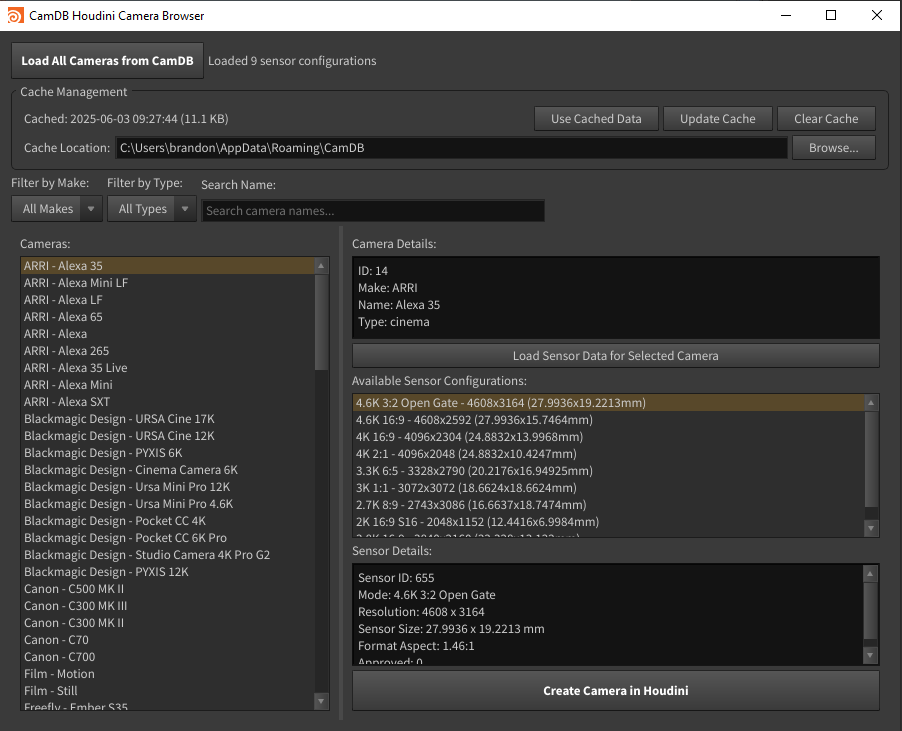

# CamDB Houdini Camera Browser



A Houdini plugin that provides seamless integration with the CamDB (Camera Database) API, allowing artists to browse, filter, and create cameras in Houdini with real-world camera specifications and sensor configurations.

## Features

- **Real-time Camera Database Access**: Connect directly to the CamDB API to browse thousands of camera models
- **Intelligent Caching System**: Automatic local caching with smart update detection to minimize API calls
- **Advanced Filtering**: Filter cameras by make, type, and search by name
- **Detailed Sensor Configurations**: View and select from multiple sensor modes for each camera
- **One-Click Camera Creation**: Automatically create Houdini cameras with correct sensor dimensions and resolution settings
- **Cross-Platform Cache Management**: Intelligent cache location selection for Windows, macOS, and Linux

## Installation

1. Download the `camDB.py` script
2. Place it in your Houdini scripts directory or any accessible location
3. Create a shelf tool in Houdini with the following Python code:
   ```python
   exec(open('/path/to/camDB.py').read())
   ```
4. Alternatively, run directly from the Python Source Editor in Houdini

## Requirements

- **Houdini**: 18.0 or later (tested with versions supporting PySide2)
- **Internet Connection**: Required for initial data loading and cache updates

## Usage

### Getting Started

1. **Launch the Plugin**: Click your shelf tool or run the script
2. **Load Camera Data**: 
   - Click "Load All Cameras from CamDB" for fresh data
   - Or use "Use Cached Data" if you have previously loaded cameras
3. **Browse and Filter**: Use the filtering controls to find your desired camera
4. **Load Sensor Data**: Select a camera and click "Load Sensor Data"
5. **Create Camera**: Choose a sensor configuration and click "Create Camera in Houdini"

### Interface Overview

#### Header Section
- **Load All Cameras**: Fetches the complete camera database from the API
- **Status Display**: Shows current operation status and data information

#### Cache Management
- **Cache Info**: Displays cache timestamp and file size
- **Use Cached Data**: Load previously downloaded camera data
- **Update Cache**: Refresh cache with latest API data
- **Clear Cache**: Remove all cached data
- **Browse Location**: Change cache storage location

#### Filtering Controls
- **Filter by Make**: Dropdown to filter cameras by manufacturer (Canon, Sony, RED, etc.)
- **Filter by Type**: Dropdown to filter by camera type (DSLR, Cinema, etc.)
- **Search Name**: Text field to search camera names

#### Main Interface
- **Camera List**: Displays filtered cameras with make and model
- **Camera Details**: Shows selected camera specifications
- **Sensor Configurations**: Lists available sensor modes for the selected camera
- **Sensor Details**: Displays technical specifications for the selected sensor mode

### Cache System

The plugin features an intelligent caching system that:

- **Automatically detects** the appropriate cache location for your OS:
  - **Windows**: `%APPDATA%\CamDB\`
  - **macOS**: `~/Library/Application Support/CamDB/`
  - **Linux**: `~/.local/share/CamDB/`

- **Checks for updates** by comparing data hashes to avoid unnecessary downloads
- **Stores metadata** including timestamps and version information
- **Allows custom locations** via the browse function

### Camera Creation

When you create a camera in Houdini, the plugin:

1. **Creates a new camera node** with an appropriate name
2. **Sets resolution** based on the sensor configuration
3. **Calculates aperture** using the sensor width (converted to Houdini's format)
4. **Sets aspect ratio** if available in the sensor data
5. **Adds detailed comments** with camera and sensor information
6. **Positions the camera** slightly away from the origin
7. **Offers to set** the new camera as the current viewport camera

### API Integration

The plugin connects to `https://camdb.matchmovemachine.com` and handles:

- **Compressed responses** (gzip/deflate)
- **Proper HTTP headers** for reliable connections
- **Error handling** with user-friendly messages
- **Rate limiting** through intelligent caching

## Configuration

### Debug Mode

Enable debug logging by changing the debug flag in the script:

```python
DEBUG_MODE = True  # Set to True for detailed console output
```

Debug mode provides detailed information about:
- API requests and responses
- Cache operations
- Data processing steps
- Error diagnostics

### Custom Cache Location

You can change the cache location through the UI or by modifying the script. The cache stores:
- `camdb_cameras.json`: The main camera database
- `camdb_cache_info.json`: Cache metadata and version information

## Troubleshooting

### Common Issues

**"Error loading cameras: API request failed"**
- Check your internet connection
- Verify the CamDB API is accessible
- Enable debug mode for detailed error information

**"No sensor configurations found"**
- Some cameras may not have sensor data in the database
- Try a different camera model
- Check the debug output for API response details

**Cache-related errors**
- Ensure you have write permissions to the cache directory
- Try clearing the cache and reloading
- Check available disk space

### Debug Information

Enable `DEBUG_MODE = True` to see detailed information about:
- API endpoints being called
- Raw API responses
- Data processing steps
- Cache operations
- Error stack traces

## Technical Details

### Camera Parameter Conversion

The plugin performs several conversions to match Houdini's camera system:

- **Aperture Calculation**: Converts sensor width (mm) to Houdini's aperture value using the formula: `(sensor_width / 36.0) * 41.4214`
- **Resolution Mapping**: Directly maps sensor resolution to Houdini's resolution parameters
- **Aspect Ratio**: Uses the format aspect ratio when available

### Data Structure

The plugin handles camera data with the following key fields:
- `id`: Unique camera identifier
- `make`: Camera manufacturer
- `name`: Camera model name
- `cam_type`: Camera category
- Sensor configurations with resolution, sensor dimensions, and format specifications

## Contributing

Contributions are welcome! Areas for improvement:
- Additional camera parameter mappings
- Extended sensor configuration options
- UI enhancements
- Performance optimizations
- Error handling improvements


## Changelog

### Version 1.0
- Initial release with core functionality
- Cache management system
- Complete UI implementation
- Cross-platform support

## Support

For issues and feature requests, please [create an issue on GitHub].

---

**Note**: This plugin requires an active internet connection for initial data loading. The CamDB service provides camera specifications for educational and professional use.